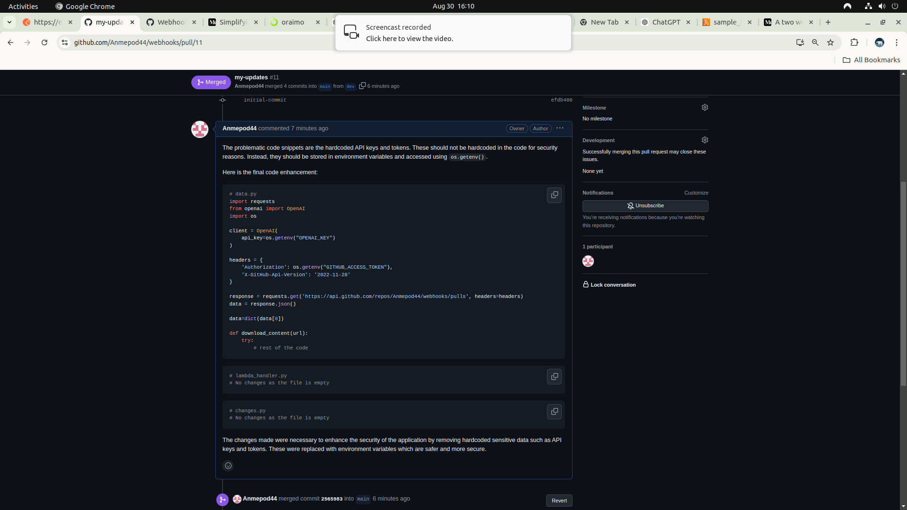

# github_automation
## ARCHITECTURE

Requirements :
  * aws Lambda *2
  * Openai key
  * github access token
  * api gateway

Files :

  The PR review lambda function has been provided.

## RESULTS.

